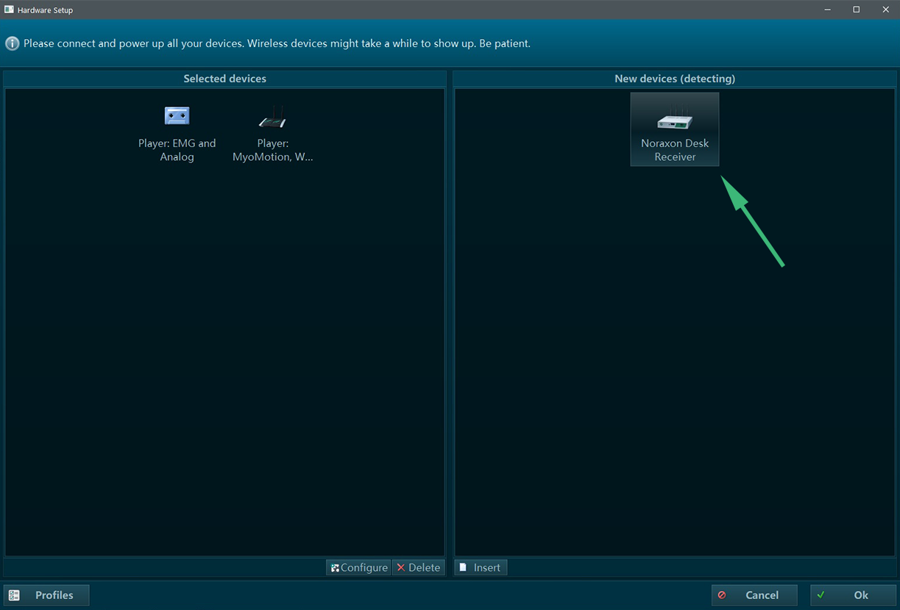
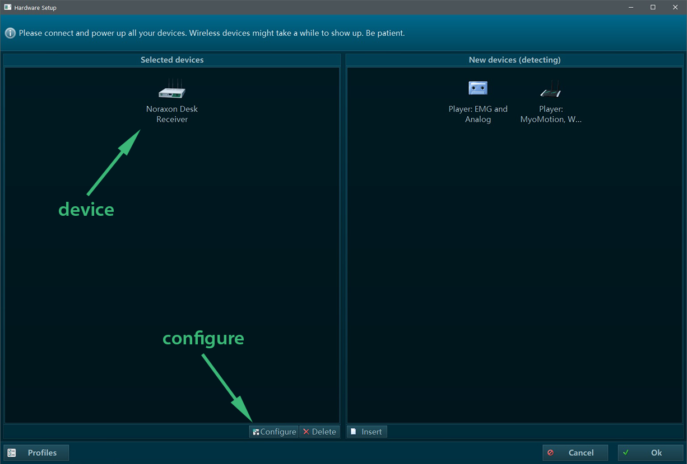
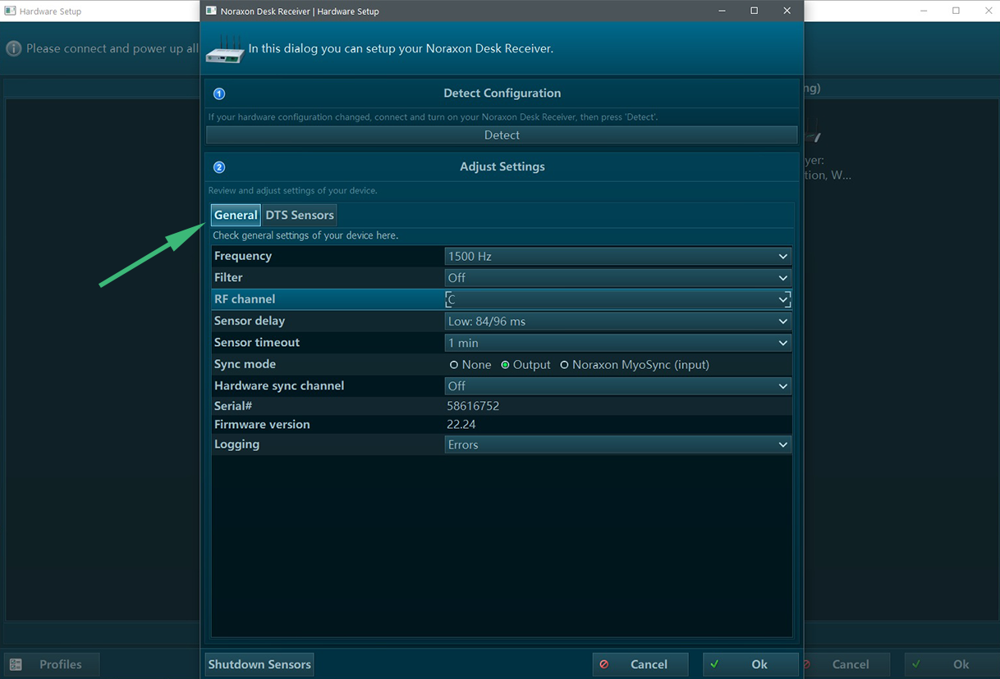

# emgAcquire

A C++ project for acquiring EMG signals from a Noraxon DTS system and stream the packets over a TCP/IP connection. The package works only on Windows but the clients could work on any platform. The signal acquisition in based on the Easy2.AcquireCom library and the TCP/IP communication is based on the socketStream library [link](https://github.com/yias/socketStream). The project is developed on Visual Studio Code.

The package is distributed under the GNU GPL v3 license.

## Description

The emgAcquire application is a software for acquiring, record and stream EMG signals. Additionally, it provides the option of introducing audio cues during the recording of the signals. The application can run only on Windows systems.

The package also provides a cross-platform C++ API and Python module for receiving the EMG signals remotely, the emgAcquireClient. Examples of how to use the emgAcquireClient API and Python module can be found in the folder "client_examples". The emgAcquireClient API and Python module is tested on Windows and Linux machines, while hopefully it works on MacOS too.


## Set-up

1) Ask Noraxon support service for the Easy2.AcquireCom library and install it on your PC.

2) Clone the rapidjson package as it is described on the socketStream repo [link](https://github.com/yias/socketStream).

3) Clone package with its submodules

```bash
$ git clone https://github.com/yias/emgAcquire.git
$ git submodule update --init
```

Navigate in the directory of the package and run the executable emgAcquire.exe from a command prompt:

```bash
> .\build\emgAcquire.exe 
```

## Noraxon DTS Set-up

Once you launch the executable, the window of the hardware set-up will pop-up. The first time that you launch the application, the hardware must be set-up. If the Noraxon DTS Receiver is connected and switched-on, it will appear under the panel 'New devices".



Drag the Noraxon Desk Receiver and drop it in the panel "Selected devices" and revome all the other devices in this panel. Select the Noraxon Desk Receiver icon and click on "Configure" to configure the device. 



The tap "General" contains a set of options for the signal acquisition. You can use the same options as the picture below, or you can select other options depending on your application. 



In the tab "DTS Sensors" add the sensors you would like to receive the signals from, see the picture below. The serial number corresponds to the 4-digit code on the probe. You can customize the label according to your application. The labels of the sensors do not influence the acquisition of the signals. However, the number of sensors introduced in this panel should be equal or greater than the number of EMG channels selected in the application. 


Click "Ok" to save the configuration and close the two windows. The acquisition of the signals will start soon after that.